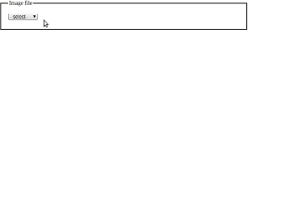

[![npm][npm-image]][npm-url]  [![javascript style guide][standard-image]][standard-url]

[npm-image]: https://img.shields.io/npm/v/npm.svg
[npm-url]: https://www.npmjs.com/package/magic-erase-console
[standard-image]: https://img.shields.io/badge/code_style-standard-brightgreen.svg
[standard-url]: https://standardjs.com

A simple web console application to **demostrate** the [**magic-erase**](https://github.com/rosesonfire/magic-erase) package. Clear blurry background in close-focused images, by selecting click-points on the image. Works like the magic-wand tool in Photoshopp.
# Installation
`npm i magic-erase-console --save-dev`
# Usage
In package.json:
```
{
  "scripts": {
    "console": "magic-erase-console"
  }
}
```
Then run:
```
npm run console
```



# Add images [Optional]
This web console comes with a few sample images out of the box. If you need to add your own, for now, you can use the following steps:
1. Put your image file (jpg) in the directory `<project-root>/node_modules/magic-erase-console/img`
1. Add your image information in the configuration file `<project-root>/node_modules/magic-erase-console/dist/data/options.json` with the following attributes:
	1. `id` is a **unique string** and must be different from the others in the configuration file.
	1. `name` is the **displayed name** of your image.
	1. `src` is the **file name** of your image, e.g. `myImage.jpg`. **DO NOT** include the path of the image.
	1. `sensitivity` is the default **sensitivity** of your image. It **MUST** be set between **0.1 to 100**.
# Caution
- Bigger images will take longer time.